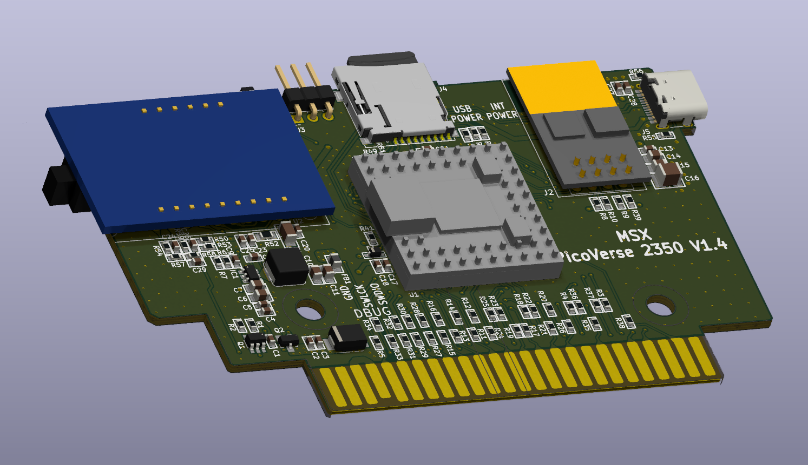
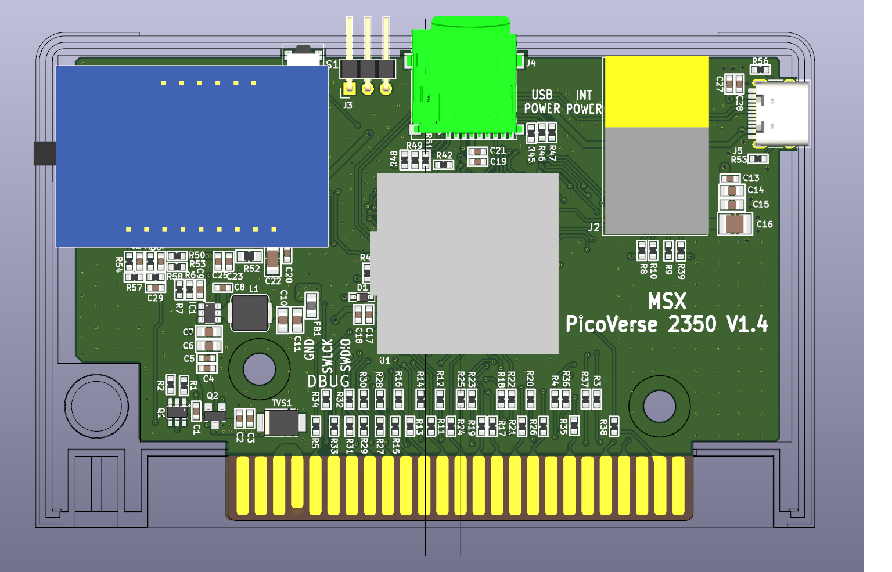
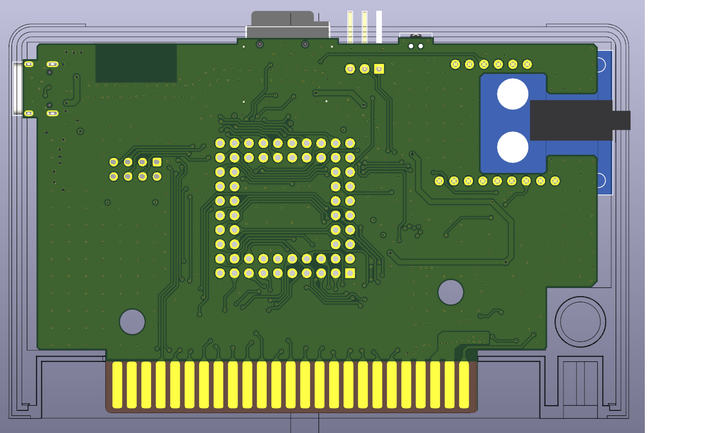
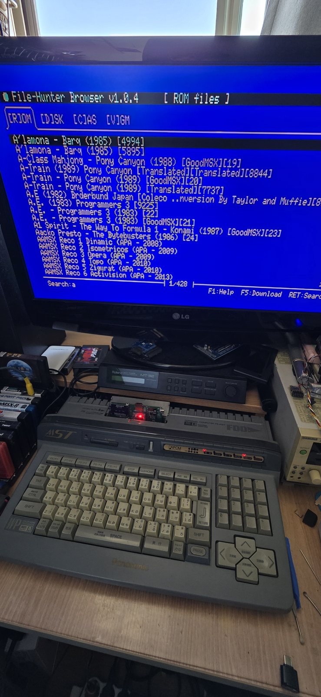
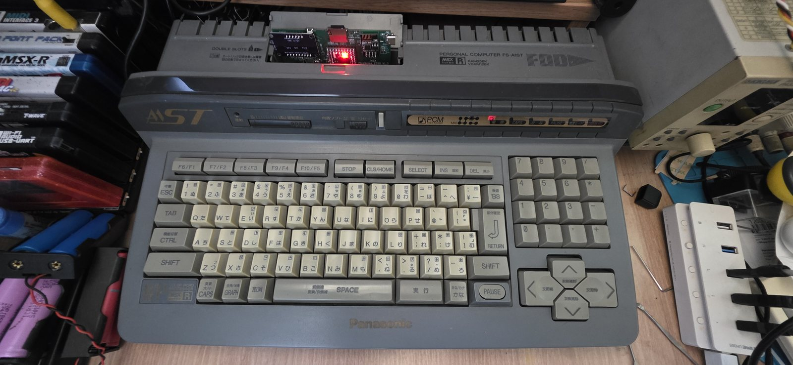

# MSX PicoVerse 2350 — rev 1.4 (ESLAB derivative)

A derivative hardware revision of **The Retro Hacker's MSX PicoVerse 2350**, re-laid out in
KiCad 10 as a 4-layer board with a full source project (schematic, PCB, footprints, 3D models,
gerbers, BOM and JLCPCB fabrication data).

> **Original design:** [cristianoag/msx-picoverse-public](https://github.com/cristianoag/msx-picoverse-public) — The Retro Hacker
> **This revision:** ESLAB (Cona), 2026
> **License:** CC BY-NC-SA 4.0, same as the original

---

## Status

**rev 1.3 was built and tested on real hardware — a Panasonic MSX2, an FS-A1ST Turbo R and an
OCM. The problems found there were fixed, and the result is rev 1.4 — the design published
here.** Hardware compatibility with the original is maintained: the existing PicoVerse 2350
firmware (`explorer.pio`, `loadrom.pio`, `multirom.pio`) runs unmodified, and no firmware change
is needed for this board.

| Function | Status |
|---|---|
| MSX cartridge bus / ROM emulation | ✅ |
| microSD storage (Sunrise IDE / Nextor) | ✅ |
| USB mass storage (Sunrise IDE / Nextor) | ✅ |
| USB-C firmware upload (BOOTSEL) | ✅ |
| I2S audio out (UDA1334A) | ✅ |
| PSG / SCC / MSX-MUSIC / YM2151 / MP3 | ✅ |
| ESP-01 WiFi | ✅ — **module firmware update required, see below** |

**Fabrication data is complete and ready to order.** Gerbers, drill files, the JLCPCB placement
file (CPL) and the assembly BOM are all generated and cross-checked against the board file —
upload them as they are. See [Ordering](#ordering).

### ESP-01 needs a firmware update

The ESP-01 / ESP-01S modules sold today ship with **factory AT-command firmware**, which this
cartridge cannot talk to. Depending on which module you buy you will have to reflash it with the
**ESP8266 UNAPI firmware** before WiFi works.

- Protocol: single-character binary, **not** `AT+...`
- Baud rate: **859372**, not 115200
- Firmware: [ducasp/ESP8266-UNAPI-Firmware](https://github.com/ducasp/ESP8266-UNAPI-Firmware)
- Flash map: `fw.bin` @ `0x00000`, `certs.bin` @ `0xBB000` → **1 MB flash minimum** (ESP-01S)
- 512 KB ESP-01 modules cannot be used

Full bring-up procedure, boot strapping table, Flash Download Tool settings and diagnostics are
in [`doc/ESP01_BRINGUP.md`](doc/ESP01_BRINGUP.md).

---

## Board



| | |
|---|---|
| Dimensions | 101.15 × 66.05 mm |
| Layers | 4 (F.Cu / In1.Cu / In2.Cu / B.Cu) |
| Thickness | 1.6 mm, stackup JLC04161H-3313 |
| Surface finish | ENIG (required — gold fingers) |
| Gold fingers | J11, 25 + 25, bevelled edge |
| Parts | 104 total — 97 placed, 4 DNP, 3 board features |
| Bottom-side parts | none |

### Top



### Bottom



### Main blocks

| Ref | Part | Function |
|---|---|---|
| U1 | Waveshare Core2350B | RP2350B module, 8 MB PSRAM |
| U2 | Adafruit UDA1334A breakout | I2S stereo DAC, 3.5 mm jack overhanging the left edge |
| J2 | ESP-01 / ESP-01S socket | WiFi (see note above) |
| J4 | microSD socket | Nextor storage / ROM library |
| J5 | USB-C 16P | firmware upload **and** USB mass-storage host |
| J11 | MSX cartridge edge | 50-pin gold fingers |
| J3 | SWD header | DNP, right-angle only |
| S1 | A06-B6-1 | side-actuated BOOTSEL button |
| IC1 | AP63200WU-7 | 5 V → 3.3 V buck |
| Q1 / Q2 | DMMT5401 + SSM3J332R | ideal-diode ORing, MSX +5 V ↔ USB VBUS |

---

## How this differs from the original v1.2

The published v1.2 is a **2-layer** board (its gerber set contains only `F_Cu` and `B_Cu`) of
100.07 × 67.66 mm with **13 BOM line items** — essentially the two modules, the connectors, one
1N5819 and a handful of pull-ups. This revision is a 4-layer redraw with **39 line items /
104 parts**, and the additions fall into two groups.

### Mechanical — laid out to a moulded cartridge shell

The original provides 3D-printable shells (`2350/case/*.stl`). This revision was instead laid out
against the 2D drawing of a **commercially available plastic injection-moulded MSX cartridge
shell**, and every mechanical decision follows from it:

| | |
|---|---|
| Board outline | cut to the shell's internal profile with a deliberately tight fit — file the edge if needed rather than leave a gap, because part of the board is exposed outside the shell |
| PAD01 / PAD02 | Ø4.3 mm NPTH, positioned on the shell's screw bosses taken from the case drawing |
| S1 BOOTSEL | **side-actuated** SMD switch (A06-B6-1), actuator protruding 0.5 mm past the board outline to meet the shell's button hole. v1.2 uses a top-actuated TL3301; a top-actuated part cannot reach a side button |
| U2 3.5 mm jack | overhangs the left board edge by 3.13 mm for the shell's audio cutout |
| U2 mounting | component-side down on a 6 mm standoff, on the top side — the jack has to exit through the shell's left wall |
| J3 | right-angle header only — a vertical header hits the shell |
| U1 / U2 / J2 | no female sockets, and the header plastic spacers must be removed; socket height prevents the shell from closing |
| Finish | ENIG with bevelled gold fingers — HASL plates the fingers in tin and wears the slot contacts |

The case drawing was aligned to the board in KiCad's `User.Eco1` layer during layout.
Measured shell dimensions are recorded in [`doc/case_measured_params.md`](doc/case_measured_params.md).

### Electrical — a real power and protection section

| Added | Why |
|---|---|
| **IC1 AP63200WU-7 buck** + L1 / C10 / C11 | dedicated 5 V → 3.3 V supply instead of drawing 3V3 from the Core2350B module's own regulator |
| **Q1 DMMT5401 + Q2 SSM3J332R ideal-diode OR** | clean changeover between MSX +5 V and USB VBUS, with reverse blocking toward the MSX. v1.2 has a single 1N5819 |
| **Series resistors on the MSX bus** | R11–R26 on A0–A15, R27–R34 on D0–D7, R35–R38 on the strobes — edge-rate control and protection on a bus that is directly exposed at the slot |
| **TVS1 SM6T6V8CA** | bidirectional TVS at the MSX +5 V entry |
| **F1 FSMD075 polyfuse** | on the USB path; in rev 1.4 it also sets the USB-host current limit |
| **R52 + C22 RC filter, R50 0 Ω GNDA bridge** | separate analog supply and single-point ground for the DAC |
| **R55 / R56 5.1 k CC pull-downs, D1 3V3 clamp** | USB-C sink termination and module 3V3 overvoltage clamp |
| **ESP-01 strapping pull-ups at 4.7 kΩ** | R8 / R9 / R10 / R39 — margin against the RP2350's internal pull-downs |

---

## Revision history

**rev 1.3** — the first ESLAB board. Built, assembled and tested on real machines (see
[Verified on hardware](#verified-on-hardware)). Everything worked except **USB mass storage**,
which never enumerated.

**rev 1.4** — fixes what rev 1.3 got wrong, and is the design published here.

| Fixed | What it was |
|---|---|
| **USB mass storage** | rev 1.3 put a series Schottky (D2) in the VBUS path, so the USB-C connector could never source VBUS and a bus-powered flash drive never powered up. D2 is gone; MSX +5 V now reaches VBUS through F1. Confirmed working on a reworked rev 1.3 board with D2 replaced by a 0 Ω link |
| **ESP-01 power** | the USB-detect / power-select circuit (SW1, Q3, Q4, R40, C12) was removed. The ESP-01 now runs from +3V3 whenever the board is powered |
| **U2 in the board file** | rev 1.3's file placed U2 on B.Cu with a 3D model whose components were on the wrong face. Neither matched the board that was actually built. The file now matches: F.Cu, rotated 180°, component-side down. The 3D model is generated from the board file itself (`tools/make_uda_model.py`) so it cannot drift again |
| **Silkscreen** | SWD labels moved next to J3; the obsolete `USB POWER` / `INT POWER` labels removed |

The rev 1.4 PCB has not been fabricated yet — the verification above was done on the reworked
rev 1.3 board, which is electrically identical in the ways that matter.

---

## Verified on hardware

The rev 1.3 board was run on four machines spanning the range that matters electrically and
for timing — an original MSX2 for hard 5 V TTL slot drive, a Turbo R for the tightest bus
timing, and an FPGA implementation for a completely different drive characteristic.

| Machine | |
|---|---|
| Panasonic MSX2 | two different models |
| **Panasonic FS-A1ST** (MSX Turbo R) | R800, tightest bus timing of the four |
| **OCM** (one-chip MSX) | FPGA implementation |

All functions were exercised on these: WiFi, USB mass storage, microSD, DAC audio and the
cartridge bus itself.



*File-Hunter Browser listing 428 ROMs over WiFi — the ESP-01 link working end to end.*



*The board in the FS-A1ST cartridge slot. Photographed bare, before the shell.*

These photographs are of rev 1.3 with D2 replaced by a 0 Ω link, which is the change rev 1.4
makes permanent.

---

## Before you build one

**⚠️ Do not connect the cartridge to a PC over USB while it is inserted in a powered-on MSX.**
Without D2 the MSX 5 V rail back-feeds the PC's VBUS. Remove the cartridge from the MSX before
flashing firmware. A load switch on a GPIO would remove the constraint and is noted as future
work; the full analysis is in [`doc/USB_MSC_2350.md`](doc/USB_MSC_2350.md).

**F1 is not a jumper.** With D2 removed, F1 (FSMD075, 0.75 A hold / 1.5 A trip) is the only
element between `+5V` and `VBUS`, and its trip current is the USB host current limit. Do not
replace it with a 0 Ω link.

**U2 needs a 6 mm standoff.** The module is mounted component-side down and the 47 µF cans are
5.4 mm tall, so the header's plastic spacer alone is not enough — use long-pin headers (≥ 11 mm)
or a separate spacer. Overall height above the PCB is 7.6 mm.

**The shell needs two openings.** A moulded cartridge shell has no holes for this board: the
3.5 mm jack exits the left wall (3.13 mm past the board outline, centre ≈ 3.5 mm above the board
surface) and the BOOTSEL button needs a side hole at S1.

---

## Repository contents

```
MSX_PicoVerse_2350_1.4/
├─ MSX_PicoVerse_2350_1.4.kicad_pro / .kicad_sch / .kicad_pcb   KiCad 10 project
├─ MSX_PicoVerse_2350_1.4.pretty/         footprints used by this board
├─ MSX_PicoVerse_2350.kicad_sym           symbols
├─ MSX_PicoVerse_2350_1.3.3dshapes/       STEP / WRL models
├─ gerbers/
│   ├─ MSX_PicoVerse_2350_1.4_JLCPCB_GERBER.zip   ← upload this one
│   └─ (individual gerber + drill files)
├─ MSX_PicoVerse_2350_1.4_JLCPCB_BOM.csv  JLCPCB assembly BOM (36 line items)
├─ MSX_PicoVerse_2350_1.4_JLCPCB_CPL.csv  JLCPCB placement data (97 parts)
├─ MSX_PicoVerse_2350_1.4_BOM.csv         detailed BOM with assembly notes (Korean)
├─ tools/                                 BOM / CPL / 3D model generators (Python)
├─ doc/                                   engineering notes (Korean)
└─ pcb_image/                             renders and test photos used in this README
```

The `.3dshapes` folder still carries the `1.3` name from when the project was branched; the model
paths inside the board file point at it, so it is kept as-is.

### Regenerating the fabrication data

```bash
python3 tools/rev14_jlcpcb.py     # JLCPCB BOM + CPL, read straight from the .kicad_pcb
python3 tools/rev14_bom.py        # detailed BOM
python3 tools/make_uda_model.py MSX_PicoVerse_2350_1.3.3dshapes   # U2 3D model
```

No external dependencies except `cadquery` for the STEP export.

---

## Ordering

Everything needed for a JLCPCB order is in this folder and has been verified against the board
file — 97 placements cross-checked for position, side and rotation, and the BOM line items
matched to the placement list.

| File | Upload to |
|---|---|
| `gerbers/MSX_PicoVerse_2350_1.4_JLCPCB_GERBER.zip` | PCB — gerbers + PTH/NPTH drill (14 files) |
| `MSX_PicoVerse_2350_1.4_JLCPCB_CPL.csv` | SMT — Component Placement, 97 parts |
| `MSX_PicoVerse_2350_1.4_JLCPCB_BOM.csv` | SMT — Bill of Materials, 36 line items |

The CPL uses absolute coordinates (no auxiliary origin), the same origin as the gerbers:
`Mid X = KiCad X`, `Mid Y = −KiCad Y`. **The `LCSC Part #` column is intentionally empty** — pick
the parts in JLCPCB's matching screen, then record the numbers you chose, because re-running
`tools/rev14_jlcpcb.py` clears the column again.

Upload the `..._JLCPCB_GERBER.zip`, **not** the raw `gerbers/` folder, which still contains stale
user-layer files whose geometry extends past the board outline. The zip has been put through
JLCPCB's quoting page as-is: it parses cleanly and the layer count is detected as 4.

The board is 101.15 × 66.05 mm. Only one side exceeds 100 mm, which does not push it out of
JLCPCB's 4-layer price tier. Quoted on 5 bare boards, September 2026:

| | |
|---|---|
| 4 layer / 1.6 mm / HASL, default stackup | $8.00 |
| + **ENIG** (required for the gold fingers) | **$25.40** — surface finish adds $17.40 |
| + **JLC04161H-3313** impedance stackup | **no extra charge** |

The impedance stackup being free is the reason to just select it. Gold fingers are a separate
toggle further down the order page and are priced separately again — check the total after
enabling them.

| Option | Value |
|---|---|
| Layers / thickness | 4 / 1.6 mm |
| Surface finish | **ENIG** (gold fingers are tin-plated with HASL) |
| Gold fingers | Yes, 30° or 45° bevel |
| Via covering | Tented, both sides |
| Impedance / stackup | **JLC04161H-3313** (see below) |
| Assembly side | Top only |

`U1`, `U2`, `J2` and `J5` cannot be machine-placed — deselect them and hand-solder.
`C16`, `J3`, `R43`, `R44` are DNP.

### Stackup — pick JLC04161H-3313

The USB-C D+/D− pair runs as a 90 Ω differential pair on the top layer, referenced to the
In1.Cu ground plane. Under JLCPCB's **Layer Stackup** option choose **`JLC04161H-3313`**
(4 layer / 1.6 mm / outer 1 oz / inner 0.5 oz):

```
Top       0.035
Prepreg   3313 ×1   0.0994      ← the dielectric the USB pair references
L2        0.0152
Core      1.265
L3        0.0152
Prepreg   3313 ×1   0.0994
Bottom    0.035
```

JLCPCB's default 4-layer stackup puts a much thicker prepreg under the top layer, which pulls
the differential impedance of the drawn trace geometry away from 90 Ω. `-3313` keeps the top
dielectric at ~0.1 mm, which is what the routing was drawn for. **Selecting it costs nothing**
on the quote, so there is no reason not to.

**One caveat:** JLCPCB flags this as a special stackup that **does not support Economic PCB
assembly**. For bare boards or Standard assembly it makes no difference. If you specifically
want Economic assembly, revert to the default stackup and accept the impedance drift — USB 2.0
full speed is tolerant over traces this short. Treat `-3313` as preferred, not mandatory.

Step-by-step ordering procedure: [`doc/JLCPCB_HOWTO.md`](doc/JLCPCB_HOWTO.md)
Fabrication notes and part substitution warnings: [`doc/JLCPCB_ORDER.md`](doc/JLCPCB_ORDER.md)

---

## Documentation

| File | Contents |
|---|---|
| `doc/REV14_CHANGES.md` | rev 1.3 → 1.4 change summary — start here |
| `doc/USB_MSC_2350.md` | why USB mass storage did not work, and the fix |
| `doc/ESP01_BRINGUP.md` | ESP-01 bring-up, firmware flashing, diagnostics |
| `doc/JLCPCB_HOWTO.md` | JLCPCB ordering procedure |
| `doc/JLCPCB_ORDER.md` | fabrication spec and assembly cautions |
| `doc/FREECAD_MCP_CASE_MODELING.md` | enclosure modelling work notes |
| `doc/case_measured_params.md` | measured case dimensions |

These are written in Korean.

---

## Credits

This board is a derivative work. The original MSX PicoVerse 2350 design, all firmware, the MSX-side
software and the Nextor / Sunrise IDE integration are by **Cristiano Goncalves (The Retro Hacker)**
and are licensed under **Creative Commons Attribution-NonCommercial-ShareAlike 4.0 International**.
This revision is released under the same licence.

- Original project: https://github.com/cristianoag/msx-picoverse-public
- Sunrise IDE driver for Nextor: Konamiman, Piter Punk, FRS
- Sound cores: `emu2149` / `emu2212` / `emu2413` © Mitsutaka Okazaki, `ymfm` © Aaron Giles

---

## 한국어 요약

The Retro Hacker 의 MSX PicoVerse 2350 을 KiCad 10 에서 4층 기판으로 다시 그린 파생 리비전이다.
**rev 1.3 을 제작해 실기에서 검증했고, 거기서 드러난 문제를 고친 것이 rev 1.4 다.**
원본 설계와의 하드웨어 호환성은 그대로이며 기존 펌웨어를 수정 없이 쓴다.

검증에 쓴 기기는 **파나소닉 MSX2 2기종 · FS-A1ST(Turbo R) · OCM(원칩 MSX)** 네 대다.
5V TTL 로 세게 드라이브하는 오리지널기, 버스 타이밍이 가장 빡빡한 Turbo R, 드라이브 특성이
아예 다른 FPGA 구현으로 양 끝을 물렸다. WiFi · USB 메모리 · microSD · DAC 를 모두 확인했다.

**원작자 v1.2 와의 차이**는 두 갈래다.

*기계적으로는* 3D 프린팅 셸이 아니라 **시판 사출 MSX 카트리지 셸**의 도면에 맞춰 외형·마운팅홀·
커넥터 위치·부품 높이를 잡았다. 셸 버튼 구멍에 맞는 **측면 푸시형** BOOTSEL 스위치, 셸 타공으로
나가는 3.5mm 잭(외곽선 밖 3.13mm), 라이트앵글 전용 J3, 암소켓 금지가 모두 여기서 나온다.

*전기적으로는* v1.2 가 13품목(모듈 2개 + 커넥터 + 1N5819 + 풀업 몇 개)의 **2층** 기판인 데 비해,
이쪽은 **4층 / 39품목 / 104부품**이다. AP63200 벅, Q1·Q2 이상 다이오드 오링, MSX 버스 직렬저항
28개(A0~A15 · D0~D7 · 스트로브), TVS, 폴리퓨즈, DAC 전원 RC 필터와 단일점 GND 브리지가 추가됐다.

**ESP-01 은 구매한 제품에 따라 펌웨어 업데이트가 필요하다.** 요즘 파는 모듈은 공장 출하 AT 커맨드
펌웨어가 들어 있어 통신이 되지 않는다. ESP8266 UNAPI 펌웨어로 다시 구워야 하며 1MB 플래시
이상이어야 한다 — `doc/ESP01_BRINGUP.md`.

**만들기 전에 알아둘 것** — MSX 에 꽂은 상태로 PC 에 USB 를 연결하면 안 된다(역급전).
F1 은 점퍼로 대체 금지(USB 호스트 전류 제한을 겸한다). U2 는 6mm 스탠드오프가 필요하다.
사출 셸에는 잭 타공과 버튼 구멍을 직접 가공해야 한다.
